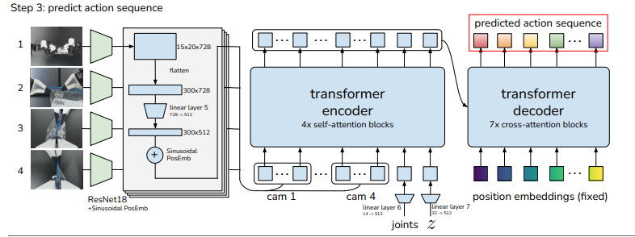

# Action Chunking Transformer

## Training


The whole model is trained as a Conditional VAE, which means it first produces a latent code extracted from the input (called encoder, left in the picture), and then uses the latent code to restore the input (called decoder, right in the picture). In details, it regards observations as the conditions to constrain and help itself to perform better.

### Input

```python
# joints: joint position/torques
# action sequence: a sequence of action in order
# images: the images store image info in every single timestep from wrist, front, top cameras 
```

### Encoder & Decoder

As it described above, the `encoder` is a transformer encoder, which produces a style variable from input.


```python
""" Encoder -> get z style variable or latent input"""
# project action sequence to embedding dim, and concat with a CLS token
action_embed = self.encoder_action_proj(actions) # (bs, seq, hidden_dim)
qpos_embed = self.encoder_joint_proj(qpos)  # (bs, hidden_dim)
qpos_embed = torch.unsqueeze(qpos_embed, axis=1)  # (bs, 1, hidden_dim)
cls_embed = self.cls_embed.weight # (1, hidden_dim)
cls_embed = torch.unsqueeze(cls_embed, axis=0).repeat(bs, 1, 1) # (bs, 1, hidden_dim)
encoder_input = torch.cat([cls_embed, qpos_embed, action_embed], axis=1) # (bs, seq+1, hidden_dim)
encoder_input = encoder_input.permute(1, 0, 2) # (seq+1, bs, hidden_dim)
# do not mask cls token
cls_joint_is_pad = torch.full((bs, 2), False).to(qpos.device) # False: not a padding
is_pad = torch.cat([cls_joint_is_pad, is_pad], axis=1)  # (bs, seq+1)
# obtain position embedding
pos_embed = self.pos_table.clone().detach()
pos_embed = pos_embed.permute(1, 0, 2)  # (seq+1, 1, hidden_dim)
# query model
encoder_output = self.encoder(encoder_input, pos=pos_embed, src_key_padding_mask=is_pad)
encoder_output = encoder_output[0] # take cls output only
latent_info = self.latent_proj(encoder_output)
mu = latent_info[:, :self.latent_dim]
logvar = latent_info[:, self.latent_dim:]
latent_sample = reparametrize(mu, logvar)
latent_input = self.latent_out_proj(latent_sample)
```

The `decoder` includes a resnet block to process images, a transformer encoder and a transformer decoder.



```python
# Image observation features and position embeddings
all_cam_features = []
all_cam_pos = []
for cam_id, cam_name in enumerate(self.camera_names):

    features, pos = self.backbones[0](image[:, cam_id]) # HARDCODED
    features = features[0] # take the last layer feature
    pos = pos[0]
    all_cam_features.append(self.input_proj(features))
    all_cam_pos.append(pos)
# proprioception features
proprio_input = self.input_proj_robot_state(qpos)
# fold camera dimension into width dimension
src = torch.cat(all_cam_features, axis=3)
pos = torch.cat(all_cam_pos, axis=3)
hs = self.transformer(src, None, self.query_embed.weight, pos, latent_input, proprio_input, self.additional_pos_embed.weight)[0]
```

### Loss Function

```python
def __call__(self, qpos, image, actions=None, is_pad=None):
    env_state = None
    normalize = transforms.Normalize(mean=[0.485, 0.456, 0.406],
                                     std=[0.229, 0.224, 0.225])
    image = normalize(image)
    if actions is not None: # training time
        actions = actions[:, :self.model.num_queries]
        is_pad = is_pad[:, :self.model.num_queries]

        a_hat, is_pad_hat, (mu, logvar) = self.model(qpos, image, env_state, actions, is_pad)
        total_kld, dim_wise_kld, mean_kld = kl_divergence(mu, logvar)
        loss_dict = dict()
        all_l1 = F.l1_loss(actions, a_hat, reduction='none')
        l1 = (all_l1 * ~is_pad.unsqueeze(-1)).mean()
        loss_dict['l1'] = l1
        loss_dict['kl'] = total_kld[0]
        loss_dict['loss'] = loss_dict['l1'] + loss_dict['kl'] * self.kl_weight
        return loss_dict
    else: # inference time
        import ipdb
        # ipdb.set_trace()
        a_hat, _, (_, _) = self.model(qpos, image, env_state) # no action, sample from prior
        return a_hat
```


## Inference

When doing testing, `Encoder` will be discarded and z is simply set to the mean of the prior (i.e. zero) at test time.


```python
""" set latent input """
mu = logvar = None
latent_sample = torch.zeros([bs, self.latent_dim], dtype=torch.float32).to(qpos.device)
latent_input = self.latent_out_proj(latent_sample)
```

In testing time, policy will return actions instead of loss_dict (can be seen in Loss Function section).
